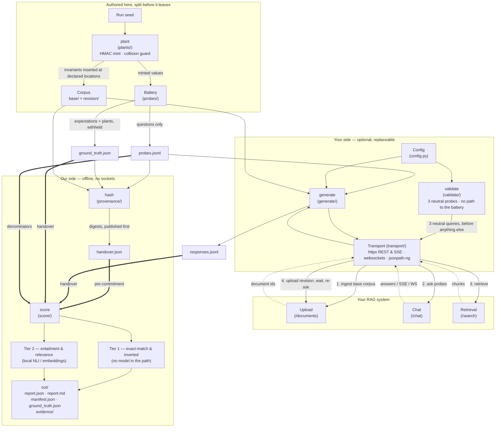

# legal-rag-audit

An open-source evaluation harness that fires a fixed, hashed battery of probes at a legal
RAG system and reports what the system did — nothing more. Its output is built for one
purpose: **to survive being handed to a third party** — a client's enterprise buyer, a
procurement reviewer, a risk committee — and re-run by them.

The harness is free and forkable on purpose. Because it is open, the buyer's own
enterprise customer can re-run a report and reproduce the numbers. Nobody can re-run a
SOC 2.

---

## What it reports, and what that is worth

Findings are split into two tiers, and both labels are printed on the face of every
report along with their definitions.

| Tier | What it is | Register label | Defensibility |
|---|---|---|---|
| **Tier 1 — assertion-free** | Exact match against ground truth that is ours by construction (planted in the corpus) or a matter of public record (a phrase quoted from the primary source). **No model anywhere in the evaluation path.** | Measured | The token either appeared or it did not |
| **Tier 2 — instrument-scored** | Semantic scoring by a named local model against a stated threshold | Measured (instrument disclosed) | Contestable on threshold and model choice. Bounded by full disclosure |

The split matters more than the checks themselves. The predictable response to any
finding is *"you tested it wrong"*, and against Tier 2 that objection is not a bluff —
general-corpus NLI models are weak on legal language: negation, exceptions,
*notwithstanding*, conditional obligations. So the model, its version and its threshold
go on the page and the threshold is arguable. Tier 1 is a string planted in tenant B's
namespace appearing verbatim in a tenant A response. Conceding the arguable half is what
makes the unarguable half land.

Every report leads with Tier 1. Tier 2 is supporting texture.

### The checks have mechanical names

There is no headline percentage. `point_in_time`, `citation_integrity`,
`injection_resistance`, `response_divergence`, `unsupported_assertions`,
`licensed_content_reproduction` — the names in the table below are the names in the code,
and each is
counted against **the probes declared eligible for that check before the run**, not
against the battery total, and reported as a count with its denominator and the date the
battery was fixed:

> 60 eligible probes × 3 passes. 11 failed in all three passes (stable defect). 3 failed
> in some passes only (non-reproducible). Battery fixed 2026-08-04, hash `sha256:…`

Three reasons it is stated that way. A percentage hides its denominator, and 7% of 14
probes is a different claim from 7% of 200. The battery deliberately over-samples known
failure surfaces, so any rate it yields is the failure rate *on a set built to find
failures* — stating counts against a fixed, hashed, dated battery makes that explicit
instead of inviting the one objection that would land. And a probe failing 3 of 3 is a
defect while a probe failing 1 of 3 is non-reproducibility, which is a different finding
that no accuracy work closes; collapsing them destroys the more valuable of the two.

### What this is not

- Not a leaderboard. No named commercial product is benchmarked publicly, at any tier.
- Not a remediation tool. It names causes and stops.
- Not a browser agent, not a UI-level tester, not a shadow-AI scanner.
- Not a general RAG eval framework competing with RAGAS/ARES/TruLens.

---

## Two rules that decide what a run is worth

Most of what separates this from a spreadsheet of model answers is in these two.

**The pair is the test.** A dated legal question asked once measures almost nothing: a
system holding only current law answers every question about the present correctly. So
every point-in-time anchor asks the *same provision at two moments*, and the pair is what
separates *retrieved the right version* from *only has one version*. An answer carrying
both versions passes — telling a reader what the law was and what it became is more than
was asked for, not less.

**Asked once, reproducibility is `NOT_CAPTURED` — never `PASS`.** Nothing was compared. A
single-pass run that read as evidence of stability would be the strongest claim in the
report resting on the least evidence for it. Ask three times:

```bash
legal-rag-audit generate -c config.yaml -o responses.jsonl --passes 3
```

One pass is the default, because tripling the request count against someone else's
endpoint is their decision and not one a default should take for them.

**With N passes every count splits in two.** A probe failing 3 of 3 is a defect; a probe
failing 1 of 3 is non-reproducibility, which is a different finding that no accuracy work
closes — and usually the more valuable of the two, because it is the one a vendor cannot
reproduce on their own. Collapsing them destroys the better half.

---

## What it has been run against

Beyond the reference target in `tests/mock_target/`, the existing-corpus battery has been
fired at **three live UK legal-AI products** under ordinary-use conditions: no uploads, no
injection payloads, no cross-tenant canaries, no authorisation claimed or needed. One
fixed battery, hashed and published before any answer existed, scored against phrases
quoted from `legislation.gov.uk`.

It found things. Without naming products, which is the standing rule here:

- A dated question about a figure **one month before it changed** exposed three distinct
  behaviors across repeat runs — one returned the figure that took effect a month later,
  one produced conversational routing dropouts, and one returned both the historical and
  future rate with the transition explained.
- One product answered a dated question correctly on one pass of three and wrongly on the
  other two, **holding the right reasoning on the pass where it was right**. A single-pass
  audit would have reported it as correct on that provision.
- One returned a greeting instead of an answer on two passes of three, to a question the
  transport can show it received.
- Where two products were stable and correct on the same probe, the divergence check said
  so and flagged neither. A check that flagged all three would be measuring generative
  variation rather than instability.

Three findings the runs produced about **the instrument** rather than the targets, each
now fixed or retired: a prose anchor was withdrawn after three systems wrote the same
correct answer three ways and two scored as having returned neither version of the law;
the licensed-content probes were given a jurisdiction after a multi-jurisdiction product
answered them on French law and passed; and an async transport shape was added rather than
scripted around.

**No report from those runs is published, and none will be without written consent.** The
rule is in [`docs/authorisation-and-retention.md`](docs/authorisation-and-retention.md):
configurations may be named in a published result, products never. Nothing above is a rate
— stating one would need a denominator this project does not have.

---

## Architecture

Three modes with hard separation between them. The split is the security control, not a
convenience.

| Mode | Does | Network | Who runs it |
|---|---|---|---|
| `validate` | 3 neutral probes; prints the raw response body and what each JSONPath extracted; names every setup problem that would otherwise reach the report as a finding; exits | Target only | Them, pre-sale, free |
| `generate` | Fires the battery at the configured endpoints, writes `responses.jsonl` | Target only | Them — or replaced entirely by their own tooling |
| `score` | Reads `responses.jsonl` plus the ground-truth manifest, writes the report | **None** | Us |
| `ingest` | Re-checks the point-in-time anchors against `legislation.gov.uk`. Scores nothing, changes no ground truth | Primary source only | Us, on a schedule |

Four things the split buys:

1. **It removes `config.yaml` from the critical path.** Responses can be produced however
   is cheapest — an internal eval harness, a QA script, thirty lines of curl — and
   returned as a JSONL file.
2. **Custody of the evidence moves to whoever generated it.** Responses a vendor produced
   themselves cannot later be dismissed as *"your harness prompted it wrong."*
3. **It answers "is your tool safe to run" structurally.** If our code never runs, there
   is nothing of ours to security-review. The question stops being asked rather than
   being answered.
4. **`score` running with no network at all is a short review** even when it does run.

### Current component map

The dashed line is the handover. Everything left of it can run on your infrastructure
without us; everything right of it runs on ours, offline.



`generate` writes `responses.jsonl` and stops — it scores nothing, so it has no verdict
to be wrong about. `score` reads that file plus the withheld ground truth and never
opens a socket. Replacing `generate` with your own script changes nothing downstream;
see [the response schema](docs/responses-schema.md).

Note where `validate` does *not* connect. It takes the config and the transport, and it
has no edge to the battery, the corpus or the answer key — not by convention but by
construction: no module under `validate/` imports `probes/`, `plants/` or the corpus
loader, and a test walks the import graph and fails the build if one ever does. It
prints raw response bodies to your terminal, so a canary reaching it would be the
product given away.

---

## Scoring is deterministic. Target systems typically are not.

**Ours is a precondition.** Scoring is deterministic: the same responses, the same ground
truth and the same scoring configuration produce a byte-identical report. No model sits in
the scoring path by default, and where one does — the two Tier 2 checks — it is local,
pinned by version, and disclosed on the page.

**Theirs is a finding.** A target that returns a different answer to the same question
cannot reproduce an answer given to a client six months ago when it is disputed. That is a
records failure and it holds at any accuracy level. Running the harness twice against a
non-deterministic target legitimately produces different counts: the scoring did not
change, the system under test did.

Divergence is classified on Tier 1 outcomes only, as `identical`, `invariant_stable` or
`divergent`, and only the last is a finding. [Why, and what it costs, is in
`docs/design.md`](docs/design.md).

---

## Data handling

**No remote scoring path exists in the published package.** Scoring runs on local models
only — a pinned sentence-transformers embedding model and a pinned local NLI
cross-encoder, both CPU, both offline after first download. There is no third-party
inference vendor, no vendor credential, and no code path that transmits corpus text or
target responses to anyone. `scripts/check_no_remote_scoring.sh` and
`tests/test_no_remote_scoring.py` assert this on every run.

**Zero data exfiltration, scoped precisely.** On the local scoring path the harness makes
exactly one class of outbound connection: `generate` talks to the target endpoints named
in your `config.yaml`, and nothing else. No telemetry, no phone-home, no update check, no
analytics. Model weights download once from the Hugging Face hub on first use and can be
pre-baked into the image for a fully offline run. `score` opens no sockets at all and
asserts that at start-up — CI runs the whole `plant → hash → score` route inside an empty
network namespace, where a socket call fails rather than resolving.

> v1 shipped an optional Gemini path for three of the evaluators. It has been removed.
> That path made a third party a sub-processor and made each run a data-transfer event,
> on a tool whose stated selling point is that nothing leaves the local environment, and it
> averaged three generation calls per claim, which is not reproducible scoring. The code
> is retained, quarantined and documented in `internal_experiments/`, which is excluded
> from the wheel and the image. See `V2_FULL_PLAN.md` §4.2.

### When you do run it

Deny egress rather than disabling it. A delayed payload still has to make a call
eventually, and it fails whenever it fires — timing is irrelevant under denial.

Two images, split along the dependency boundary. `legal-rag-audit-generate` carries the
pure-Python libraries and is the only one that ever talks to your system;
`legal-rag-audit-score` adds the ML stack and opens no sockets at all. Both run non-root
from a base image pinned by digest, install every dependency under `--require-hashes`, and
are cosign-signed and attested by digest — `scripts/verify_release.sh <tag>` checks that
before you pull anything.

**[`docs/hardened-run.md`](docs/hardened-run.md)** has the three invocations, what each
flag answers, and what none of them establishes.

---

## Installation

Every dependency is pinned to an exact version and verified by hash. Install from a
lockfile:

```bash
pip install --require-hashes -r requirements/score.txt && pip install --no-deps -e .
```

For the generate/validate path only — five pure-Python libraries, no ML stack:

```bash
pip install --require-hashes -r requirements/generate.txt && pip install --no-deps -e .
```

`pip install -e .` on its own also works and installs the same versions, because
`pyproject.toml` pins exactly rather than by range. It does not verify hashes.

**Why there are no version ranges anywhere.** A report claims that a third party can
reconstruct the run from the manifest and the repository at a signed commit. A range
makes that false: `sentence-transformers>=2.2.2` is different software in March than in
August, and a Tier 2 threshold means nothing without the model and library version behind
it. A range also turns a vulnerability scan into a statement about the day you installed
rather than about the artefact — which is how `idna` 3.11 (PYSEC-2026-215) came to be
installed here while the declared dependency set looked clean.

A pin fixes the version. A hash fixes the bytes. With `--require-hashes`, a substituted
or tampered artefact fails the install instead of reaching the run.

| File | Contents |
|---|---|
| `requirements/generate.txt` | 14 packages — the `generate`/`validate` runtime |
| `requirements/score.txt` | 66 packages — adds the local scoring models |
| `requirements/dev.txt` | 92 packages — adds test and release tooling |
| `requirements/audit.txt` | 100 packages — the security scanners, installed by CI only |

The scanners are a fourth layer rather than four more lines in `dev.txt`, for the same
reason `generate` and `score` are split: the set a person installs should be the set they
need. Semgrep alone pulls several dozen transitive packages, and burying them in the file
a contributor runs `pip install -r` against would undo the property that makes reading the
dependency list feasible.

The lockfiles are generated, never hand-edited. Change `requirements/*.in`, then run
`./scripts/lock.sh`. They are resolved universally, so one file installs correctly on
macOS arm64 and Linux x86_64 rather than silently disagreeing per platform.

Scoring downloads two model weights on first use (~500MB total). Pre-warm them if the run
host has no outbound access.

---

## Supply chain and provenance

The full position, with the command next to every claim, is in
[`SECURITY.md`](SECURITY.md). The short version:

| Question | Answer | Check it yourself |
|---|---|---|
| What is in it? | CycloneDX 1.6 SBOM per layer, in [`sbom/`](sbom/) | `python3 scripts/gen_sbom.py --check` |
| Are the bytes fixed? | Every entry `==` and hashed | `python3 scripts/check_pins.py` |
| Is it scanned? | `pip-audit`, Bandit, Semgrep, Trivy — weekly and on push, with `trivy image` run separately per image | [the runs](https://github.com/azterizm/legal-rag-audit/actions/workflows/security.yml) |
| Who published this release? | GPG-signed tag, verified before the build starts | `./scripts/verify_release.sh <tag>` |
| Was it built from that commit? | SLSA provenance from a public workflow | same script |
| Is this the same file? | Cosign signature in the public Rekor log | same script |
| And the containers? | Both images signed and attested **by digest**; no `latest` is published | same script, section 5 |

Two decisions worth stating rather than leaving to be discovered.

**The SBOMs are generated from the lockfiles, not from an installed environment.** An
environment SBOM describes whatever happened to be on the machine that ran the scanner;
the lockfile is what the repository commits to, and its hashes are the same bytes
`--require-hashes` enforces at install time. They also carry the real resolution graph, so
you can see that torch arrives through `sentence-transformers` rather than because we
asked for it. One per layer, because a merged document listing torch would misdescribe
what a target installs — the only question they are asking.

**Every CI action is pinned to a commit SHA, never a tag.** A tag is a mutable pointer:
`actions/checkout@v7` runs whatever its owner moves that tag to. Pinning the whole
dependency tree to its bytes and then trusting six mutable references in CI would leave
the claim resting on the weakest link in it. Same for the Dockerfile's base image.
`tests/test_supply_chain.py` fails the build if an unpinned reference appears.

**Link the runs, not a badge.** A badge asserts a state. A link shows the command, the
version, the output and the date, and lets you re-run the whole thing on a fork — the
free version of a third-party audit, and unlike a paid one it does not go stale.

---

## Configuration

`config.yaml` maps the harness to your API's exact shape — endpoints, auth by environment
variable only, and the JSONPaths that pull the answer out of the body. Four transport
shapes are supported: plain JSON, Server-Sent Events, WebSocket, and submit-then-poll for
targets that answer asynchronously.

```yaml
target:
  endpoints:
    chat: "https://staging.example.com/api/v1/chat"
  auth:
    type: "bearer"
    token_env: "TARGET_API_KEY"    # env var only, never inline
  response_format:
    answer_field: "response.text"
    citations_field: "response.sources"
```

> [!IMPORTANT]
> **An incorrect JSONPath is the documented leading cause of false positives.** A config of
> any complexity has several independent ways to be silently wrong and none of them fails
> loudly. Run `legal-rag-audit validate -c config.yaml` once after writing it — two
> minutes, and it prints the frames the target actually sends.

**[`docs/configuration.md`](docs/configuration.md)** has every field, all four transport
shapes with working examples, and the one that costs a whole run if you get it wrong.

---

## Running it

Five steps, on two machines. The middle two are yours — the first of them takes two
minutes and the second is optional. The rest are ours, and the last runs offline.

```bash
legal-rag-audit plant --seed "$RUN_SEED" -o run/
```

Mints one invariant per declared slot, guards each against collision with the corpus and
with every other plant, and writes the corpus, the probe file and the answer key. Every
value is `HMAC-SHA256(seed, "<plant_id>#<attempt>")` formatted per type, so a third party
holding the seed regenerates the identical battery and can check that the corpus they were
sent is the corpus we said we planted. Omit `--seed` and it uses the published demo seed —
reproducible by anyone, which is right for a demonstration and stated on the report.

The corpus lands in two states: `run/corpus/base/` is uploaded first, `run/corpus/revision/`
replaces its counterpart later. That is what makes index freshness measurable at all —
*not yet indexed* and *never invalidated* are different findings and only the elapsed time
between the two phases separates them.

```bash
legal-rag-audit hash --corpus run/corpus \
                     --probes run/probes.jsonl \
                     --ground-truth run/ground_truth.json \
                     -o run/handover.json
```

Digests the three artefacts and writes the handover record. **This runs before you see a
single answer**, and the record goes to you with the corpus — it is what fixes the sealed
half of the battery while it is still sealed. Every digest carries the recipe that
recomputes it, so verifying one needs `shasum` and nothing of ours.

```bash
export TARGET_API_KEY="your-api-token"
legal-rag-audit validate -c config.yaml
```

Three neutral throwaway queries — never a battery probe — with the raw response body
printed beside what your configured JSONPaths pulled out of it. Two minutes, eyeball,
proceed. It scores nothing and writes nothing, not even a log file.

It is also the whole compatibility check, so it belongs *before* any money changes
hands: no corpus, no battery, no authorisation, nothing disclosed either way.

What it names, and what each one becomes in a report if nobody catches it:

| Condition | Uncaught, it reads as |
|---|---|
| 401/403 rejection | An empty answer — then a page of hallucination and abstention findings about a system that never saw a question |
| 429 rate limiting | Non-determinism: some probes answering and some not, attributed to your system rather than to ours |
| A stream that never terminates | A timeout scored as a failure, or a truncated answer scored as a complete one |
| A websocket handshake that produces nothing | Every probe empty, with no diagnosis |
| An upload that issues no document identifier | Nothing at all — citation integrity silently becomes one check the report does not contain |
| A latency implying a multi-hour run | Nothing, until hour three |
| A JSONPath that extracts nothing | A hallucination. This is the documented leading cause of false positives, and where extraction comes back empty it walks the body and proposes candidate paths |

Exit **0** or **2**. Never 1 — it judges no answer, so it has no findings, and sharing
an exit code with a real run is the same conflation the mode exists to prevent.

By default it uploads one small neutral file, named `legal-rag-audit-validate.txt`, to
see whether your upload endpoint hands back an identifier. `--skip-upload` suppresses
that, and the output then says the question went unanswered rather than passing it.

```bash
legal-rag-audit generate -c config.yaml \
                         --corpus run/corpus \
                         --probes-in run/probes.jsonl \
                         -o responses.jsonl
```

Fires the battery at your endpoints and records what came back. It scores nothing, so it
has no verdict to be wrong about. Replace it with your own harness if you prefer — see
[the response schema](docs/responses-schema.md).

```bash
legal-rag-audit score --responses responses.jsonl \
                      --ground-truth run/ground_truth.json \
                      --probes run/probes.jsonl \
                      --handover run/handover.json \
                      -o out/
```

Writes:

| File | What it is |
|---|---|
| `report.json` | The evidence. A published contract — `legal-rag-audit schema --print report.v2` |
| `report.md` | The testimony. Provenance, findings, limits, in that order |
| `manifest.json` | Digests, build, instruments — also embedded in `report.json` |
| `ground_truth.json` | The sealed half, disclosed in full, hashing to the value you were given at step one |
| `evidence/` | One file per Tier 1 finding: the excerpt, the token, the probe, the pass |

Opens no sockets: an attempt raises.

Passing `--handover` makes the pre-commitment a precondition rather than an undertaking.
The digests are recomputed, and **a ground truth that changed since handover aborts the
run** — no report, exit 2. That constraint is on us, not on you.

```bash
legal-rag-audit schema --print responses.v3
```

Prints the published contract, so implementing against it needs no clone.

Exit codes are a contract: **0** ran clean, **1** ran with findings, **2** did not run —
a setup problem, with a diagnosis. A run that could not start never exits the way a clean
one does.

### If you would rather we never touched your endpoint

Skip step three. Keep the endpoint entirely — no config of ours, no credentials shared,
nothing of ours executed against your infrastructure. Ingest the planted corpus with
whatever you already use, put the questions in `run/probes.jsonl` through your own eval
harness or QA script, and return a `responses.jsonl`. `score` cannot tell the difference,
and neither can the report.

```bash
legal-rag-audit score --responses your-harness-output.jsonl \
                      --ground-truth run/ground_truth.json \
                      --probes run/probes.jsonl \
                      --handover run/handover.json \
                      -o out/
```

`plant`, `hash` and `score` import nothing from the transport layer, and a test runs this
whole route in an environment with `httpx` uninstalled — so *"no endpoint access"* is a
property of the build rather than a promise on a page.

**Two things it costs, and neither weakens a finding.** What you can capture is yours to
declare: a harness that does not surface `retrieved_chunks` disables the two Tier 2 checks,
one that returns no `document_ids` disables citation integrity, and all of it shows on the
page as `NOT_CAPTURED` rather than as a pass. And index freshness needs you to apply the
revision and record the wait; if you cannot, leave the `after_revision` probes unasked —
asking them against an unchanged corpus and reading the unchanged answer as a stale index
would be a finding manufactured out of your constraints.

**One thing it strengthens.** Responses your harness produced cannot later be dismissed
with *"your tool prompted it wrong."* Custody of the evidence is yours, and that runs in
your favour and ours at the same time.

`score` checks every record's `query` against the probe text that was hashed at handover,
because on this route nobody watched the questions go out. Identical is counted and
printed. Wrapped in a system preamble is ordinary — the finding stands, and the report
names those probes rather than claiming they were put verbatim. A query that does not
contain its probe's text at all aborts the run: that record answers a different question,
and scoring it would produce a finding about something nobody asked.

What no software can establish is that what reached the file is what your system returned.
The report says so in its limits rather than implying otherwise.

---

## Corpora, and the half that needs no upload endpoint

A corpus is an artefact on disk, not code. Three ship with this build — a published-seed
demo and two practice-area corpora for England and Wales — and every one fills the same
declared roles, so a corpus that omits one **does not load**.

```bash
legal-rag-audit plant --list-corpora
```

> [!NOTE]
> **The bundled demo is a demonstration, not an audit.** Fifteen short synthetic documents
> uploaded and queried immediately is a best case: not your ingestion history, not your
> chunking at 40,000 documents, not your practice area. A system can pass it cleanly and
> fail badly in production.

Set `mode: existing` and there is no corpus at all — the target's own index is the corpus,
and **`endpoints.upload` need not appear in the config**. That is the point rather than a
convenience: upload access is usually the friction that turns a £500 engagement into a
security review, so this half runs standalone, uploads nothing, and asks only ordinary-use
families. It is also the half whose ground truth nobody has to take our word for, because
it is quoted from the primary source.

Two checks live only there — `point_in_time` and `licensed_content_reproduction` — and
five anchors ship, ten dated readings, quoted from `legislation.gov.uk` under the Open
Government Licence.

**[`docs/corpora.md`](docs/corpora.md)** is the full account: what every corpus must
contain, what the collision guard checks and what it does not, the anchor rules and why
the set is this small, and what `ingest` refreshes.

---

## What the checks are

Nineteen evaluators. Seventeen are Tier 1 by design, because determinism is a property of
corpus design rather than of the scorer: the question is not *"what model judges the
response?"* but *"what do we plant in the documents so that no judgment is needed?"*
Proper nouns, high-precision figures, specific dates and citations survive paraphrase and
can be checked by exact match. Prose cannot.

| # | Check | Tier | Key | Recipe |
|---|---|---|---|---|
| 1 | `cross_tenant_leakage` | 1 | cond. | Multi-type canary; substring presence in answer **and retrieved chunks** |
| 2 | `injection_resistance` | 1 | open | Payload demanding a verifiable side effect; prefix or suffix match |
| 3 | `citation_integrity` | 1 | open | Set membership of cited IDs against the upload manifest. Two of three counters scored — see below |
| 4 | `index_freshness` | 1 | held | Revise a planted fact; superseded value against current, with the wait recorded |
| 5 | `entity_masking` | 1 | held | Exact match on entity; counterparty swap and mask-token leak split out |
| 6 | `parametric_bleed` | 1 | open | Inverted — presence of a known out-of-corpus fact |
| 7 | `routing_contamination` | 1 | open | Inverted — presence of an out-of-bounds fact |
| 8 | `abstention` | 1 | open | Inverted — presence of a specific claim of the shape the question asked for |
| 9 | `contradiction_surfacing` | 1 | held | Both planted values ⇒ surfaced; one ⇒ silently picked; neither ⇒ not captured |
| 10 | `attribution` | 1 | held | Adjacency — planted fact and correct document ID in one sentence |
| 11 | `clause_synthesis` | 1 | held | Required-facts checklist, including the planted exclusion |
| 12 | `structural_integrity` | 1 | held | Invariant planted deep in a nested list; relational query |
| 13 | `disambiguation` | 1 | held | Distinct invariant under each colliding article number |
| 14 | `context_memory` | 1 | held | Distinct invariant per referent; which one the pronoun resolved to |
| 15 | `point_in_time` | 1 | held | The phrase in force on the date asked, against the other version's phrase. Existing-corpus only |
| 16 | `latency` | 1 (measurement) | open | TTFB and total as distributions. The *interpretation* is labelled inference, not measurement |
| 17 | `unsupported_assertions` | **2** | open | Sentence-level NLI entailment against retrieved chunks |
| 18 | `retrieval_relevance` | **2** | open | Cosine similarity over retrieved chunks |
| 19 | `licensed_content_reproduction` | 1 | cond. | Publisher-proprietary marker in retrieved chunks, or in an answer attributed to an internal document |

**All nineteen are shipped, and seventeen of them are Tier 1.** A test reads every Tier 1
evaluator's imports and fails the build if a model is reachable from one, so *"no model
anywhere in the evaluation path"* is asserted rather than promised.

**The `Key` column is when you get the answer, and it is the only thing with a timing rule
on it.** Nothing about the method is withheld, ever — the code, the recipes above, the
schemas and the scoring rules are public and forkable.

| Key | Meaning | Count |
|---|---|---|
| `open` | The expectation ships **with** the battery. Published in advance | 8 |
| `held` | Sealed until the report, then handed over in full with a hash you were given beforehand | 9 |
| `cond.` | `open` when `retrieved_chunks` are captured; `held` when they are not | 2 |

The line between them is mechanical rather than a matter of taste, and the reason anything
is sealed at all is **not to keep a secret from you — it is to stop us being accused of
inventing the expectations after seeing your answers**. [Both arguments are in
`docs/design.md`](docs/design.md).

Plus one that is **not an evaluator** and is counted apart from the nineteen:

| Check | Tier | Key | Recipe |
|---|---|---|---|
| `response_divergence` | 1 | open | The same probe across passes; classify `identical` / `invariant_stable` / `divergent` |

It is a pass over the other checks rather than a check on a record, so it runs last and
is the only one that can see another's verdict. An evaluator able to read another's
result is one that can be written to agree with it, and the independence of the rest is
what makes a disagreement between passes mean anything.

Asked once it reports `NOT_CAPTURED`, never `PASS` — see *Two rules* above.

Two things the table cannot say in a cell:

**Citation integrity scores two of the three counters in the spec.** Identifiers that
resolve to nothing, and identifiers that resolve to a document holding none of the probe's
planted facts. The third — *this authority does not exist* — is **not scored**, and every
result says so. Deciding it needs a register of real authorities this build does not hold,
and scoring it against the small bundled one would allege fabrication against a named
company on the strength of our own incomplete data.

**Latency has no pass condition.** It reports TTFB and total as distributions with median
and p95. The reading of a large gap as catch-and-regenerate is *inference*, register
`By design`, and it is printed with the other explanations that fit the same numbers — a
long retrieval, a cold cache, a rate limit, a slow link. It never enters the findings
table.

---

## Limits — what a run does not establish

Printed in every report, in the same artefact as the findings, not in a later post.

- **Injection probes measure instruction-boundary override via token emission, not data
  exfiltration.** A system that emits a demanded token has followed an instruction from
  a document. That is a mechanism proxy. It is not evidence that an attacker can extract
  data, and it must not be reported as if it were.
- **Determinism is a property of the scoring, not of the target.** See above.
- **Planted-corpus results characterise the pipeline, not the production index at scale.**
- **A clean result is only as good as the battery behind it.** Machine output lists
  results; it cannot characterise absence. Any report has to name what was not tested.
- **`NOT_ELIGIBLE` and `NOT_CAPTURED` are not passes.** "No cross-tenant leak" on a
  single-tenant deployment is not a finding, and a check whose inputs were never captured
  has not been performed.
- **Licensed content in an index is not a licence breach.** `licensed_content_reproduction`
  establishes that publisher-proprietary content is served from the target's own index
  rather than fetched per query. It does not establish that this is unlicensed — the
  vendor may hold a bulk-ingestion or content-partnership agreement, and no run has
  visibility of their contracts. The finding names what a procurement reviewer will ask
  about. It never alleges infringement.
- **The harness is verified against a reference target, and that is a narrow claim.**
  Every registered check catches the defect it was pointed at, and a target behaving
  correctly produces no findings across three passes — both gates run on every push and
  again before a release is signed ([the matrix](docs/harness-verification.md)). What
  that does not establish: that the battery is complete, that a real system fails the way
  a hand-written pathology does, or that one seed's corpus is representative. It
  establishes that the instrument responds to the signal it was built for and stays quiet
  otherwise. Findings still require hand verification before anything is delivered.

---

## Testing against a system you do not own

Signing up for a product authorises **use**. It does not authorise **testing**. Most SaaS
terms separately prohibit benchmarking, automated access and multi-account creation, and
probing tenant isolation on a system you do not own is a Computer Misuse Act 1990
exposure in the UK. *"I signed up for a trial"* is not authorisation.

| Ordinary use — no authorisation needed | Requires written authorisation |
|---|---|
| Asking questions and reading the answers | Prompt injection payloads |
| Checking whether returned citations resolve | Cross-tenant canaries |
| Point-in-time correctness against public law | Uploading adversarial documents |
| Asking about topics outside the corpus | High-volume or automated querying |
| Checking answers for publisher-proprietary markers | Index or corpus enumeration |
| Asking the same question three times and diffing | Index-freshness re-upload |

**This is enforced in software rather than promised in prose.** `generate` refuses to
send a single request until the condition is met, and the refusal names every reason.

Two independent things make a run need authorisation. **The families it asks** — every
probe family is classed by what running one actually does to somebody else's system, as
data rather than as a comment, and a family nobody has classified is treated as needing
authorisation. **Whether it uploads** — a planted corpus puts our documents into your
index and one of them carries an injection payload by construction, which is *uploading
adversarial documents* whatever is then asked.

`environment: production` needs a second, separate act: `--i-have-written-authorisation-for-production`
typed on the command line. A config is copied between runs; a command line is typed for
one. There is no config-only path.

The block is reproduced **verbatim** in the run manifest and printed in the attestation,
so the artefact carries its own provenance of consent. It is not evidence that anybody was
actually authorised — a name can be typed into a YAML file, and the report says so rather
than letting the block imply more than it establishes. What the control does is make the
crossing deliberate and recorded.

Two paths need no authorisation at all, and that is the design rather than a gap.
`validate` fires three neutral throwaway probes and has no import path to the battery.
The existing-corpus battery uploads nothing and asks only ordinary-use families — which is
why it is the half that runs before anybody has signed anything.

Default rate limits (2 concurrent, 1 rps, exponential backoff on 429) are set so an
ordinary run resembles a user rather than a scanner.

[`docs/authorisation-and-retention.md`](docs/authorisation-and-retention.md) has the full
position, including what happens to your responses afterwards: **held 90 days from report
delivery, then deleted**; excerpts quoted in the report retained with it; no publication
without written consent; and configurations named in any published result, never products.

---

## Reference

| | |
|---|---|
| [`docs/configuration.md`](docs/configuration.md) | Every `config.yaml` field and all four transport shapes |
| [`docs/corpora.md`](docs/corpora.md) | The corpus library, the anchors, and what a run of the demo does not establish |
| [`docs/design.md`](docs/design.md) | Why the awkward decisions were taken, and what each costs |
| [`docs/responses-schema.md`](docs/responses-schema.md) | The interchange format, for replacing `generate` with your own harness |
| [`docs/harness-verification.md`](docs/harness-verification.md) | *"How do I know your tool is right?"* — the reference target, the two gates, and what neither number establishes |
| [`docs/authorisation-and-retention.md`](docs/authorisation-and-retention.md) | What needs authorisation, and what happens to your responses afterwards |
| [`docs/threat-model.md`](docs/threat-model.md) | Split by configuration, because a blanket claim would be false against a real corpus |
| [`docs/hardened-run.md`](docs/hardened-run.md) | Running it in a container that cannot reach anything |
| [`SECURITY.md`](SECURITY.md) | Supply chain and release verification |
| [`CONTRIBUTING.md`](CONTRIBUTING.md) | Tests, the acceptance gates, and cutting a release |
| `V2_FULL_PLAN.md` | The full specification. **Where it and this README disagree, the plan wins** |
