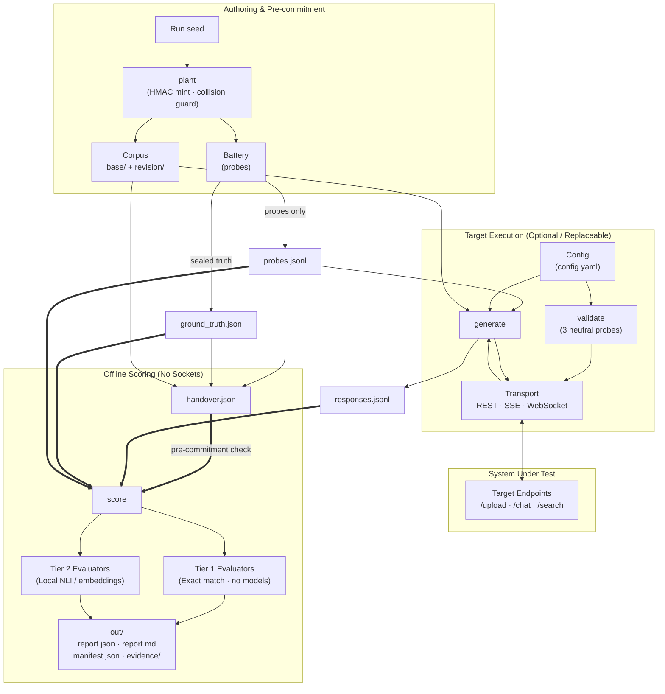

# legal-rag-audit

An open-source evaluation harness that executes a fixed, hashed battery of probes against a legal RAG system and outputs reproducible, defensible findings. Findings are structured for enterprise procurement, risk committees, and third-party validation.

---

## Table of Contents

- [Evaluation Tiers & Defensibility](#evaluation-tiers--defensibility)
- [Installation](#installation)
- [Quickstart Workflow](#quickstart-workflow)
- [Architecture & Isolation Model](#architecture--isolation-model)
- [Evaluator Catalog](#evaluator-catalog)
- [Configuration & Transports](#configuration--transports)
- [Target-Custody Offline Scoring](#target-custody-offline-scoring)
- [Security & Supply Chain Assurance](#security--supply-chain-assurance)
- [Operational Limits](#operational-limits)
- [Authorisation & Data Retention](#authorisation--data-retention)
- [Documentation Index](#documentation-index)

---

## Evaluation Tiers & Defensibility

Findings are partitioned into two tiers. Both labels and their definitions are rendered on the face of every generated report.

| Tier | Definition | Register Label | Defensibility |
|---|---|---|---|
| **Tier 1 — Assertion-free** | Exact match against ground truth established by construction (invariants planted in the corpus) or public record (statutory phrases from primary sources). No model exists anywhere in the evaluation path. | Measured | Binary occurrence: the token appeared or did not appear. |
| **Tier 2 — Instrument-scored** | Semantic evaluation by a named, pinned local model against a disclosed numerical threshold. | Measured (instrument disclosed) | Parameterized by threshold and local model selection; bounded by full disclosure. |

Every report leads with Tier 1 evidence. Tier 2 provides supporting semantic context.

### Evaluation Rules

- **Explicit Denominators**: Checks report absolute counts against declared eligible probes and completed passes (`eligible probes × passes`) alongside the fixed battery hash and date. Percentage aggregations are not used as headline metrics.
- **Temporal Probe Pairs**: Point-in-time checks query the same statutory provision across two distinct temporal moments to distinguish versioned retrieval from unversioned recency.
- **Multi-Pass Reproducibility**: A single pass reports reproducibility as `NOT_CAPTURED`, never `PASS`. Running three passes (`--passes 3`) separates stable defects (failing all passes) from non-reproducible execution (failing partial passes).

### Non-Goals

- Not a commercial product leaderboard or benchmark ranking.
- Not an automated remediation tool.
- Not a browser agent, UI tester, or shadow-AI scanner.
- Not a general-purpose RAG evaluation framework.

---

## Installation

### Standard PyPI Install (Recommended)

```bash
# Lightweight generation, validation, and planting (pure-Python, zero ML dependencies)
pip install legal-rag-audit

# Full installation including local offline scoring models (CPU-only)
pip install "legal-rag-audit[score]"
```

### Hash-Verified Source Install (Auditable / Production Runs)

```bash
# Full scoring installation (includes local CPU ML models)
pip install --require-hashes -r requirements/score.txt && pip install --no-deps -e .

# Lightweight generation/validation installation (pure-Python, no ML stack)
pip install --require-hashes -r requirements/generate.txt && pip install --no-deps -e .
```

### Editable Development Install

```bash
git clone https://github.com/azterizm/legal-rag-audit.git
cd legal-rag-audit

# Full development environment with local scoring dependencies
pip install -e ".[score]"

# Generation and validation only (pure-Python)
pip install -e .
```

### Dependency Layers

| Lockfile | Package Count | Layer Scope |
|---|---|---|
| `requirements/generate.txt` | 14 packages | `generate` and `validate` runtime |
| `requirements/score.txt` | 66 packages | Adds local scoring models (CPU-only) |
| `requirements/dev.txt` | 92 packages | Adds test, lint, and build tooling |
| `requirements/audit.txt` | 100 packages | Security scanners (`pip-audit`, Bandit, Semgrep, Trivy) |

All dependency lockfiles are generated via `./scripts/lock.sh` and resolved universally across platforms.

---

## Quickstart Workflow

### 1. Plant Invariants
```bash
legal-rag-audit plant --seed "$RUN_SEED" -o run/
```
Generates HMAC-derived invariant tokens, validates collision boundaries across documents, and outputs `corpus/`, `probes.jsonl`, and `ground_truth.json`.

### 2. Pre-Commitment Handover Hash
```bash
legal-rag-audit hash --corpus run/corpus \
                     --probes run/probes.jsonl \
                     --ground-truth run/ground_truth.json \
                     -o run/handover.json
```
Computes cryptographic digests of all run artefacts prior to target execution. Verifiable via standard `sha256sum`.

### 3. Target Compatibility Validation
```bash
export TARGET_API_KEY="target-token"
legal-rag-audit validate -c config.yaml
```
Executes 3 neutral probes to verify transport connectivity and JSONPath payload extraction. Exits with code `0` (valid) or `2` (configuration defect).

### 4. Battery Execution
```bash
legal-rag-audit generate -c config.yaml \
                         --corpus run/corpus \
                         --probes-in run/probes.jsonl \
                         --passes 3 \
                         -o responses.jsonl
```
Dispatches probes to target endpoints and records raw response payloads.

### 5. Offline Scoring
```bash
legal-rag-audit score --responses responses.jsonl \
                      --ground-truth run/ground_truth.json \
                      --probes run/probes.jsonl \
                      --handover run/handover.json \
                      -o out/
```
Executes offline scoring without network access. Aborts (exit code `2`) if ground truth digests mismatch the pre-commitment record.

### Exit Codes Contract

- `0`: Execution completed with zero findings.
- `1`: Execution completed with findings recorded.
- `2`: Execution halted due to configuration, transport, or validation defect.

---

## Architecture & Isolation Model

The harness enforces hard process and network boundaries across execution modes.

| Mode | Purpose | Network Access | Operator |
|---|---|---|---|
| `validate` | Executes 3 neutral queries, tests JSONPath extraction, identifies setup defects | Target endpoint only | Target operator (pre-sale / pre-audit) |
| `generate` | Dispatches probe battery to target endpoints, writes `responses.jsonl` | Target endpoint only | Target operator or auditor |
| `score` | Evaluates `responses.jsonl` against ground truth, writes report artefacts | **None (Offline)** | Auditor or target operator |
| `ingest` | Refreshes point-in-time statutory anchors against `legislation.gov.uk` | Primary source only | Scheduled maintenance |
| `plant` | Mints seeded invariant tokens and builds corpus/probe files | **None (Offline)** | Auditor |
| `hash` | Computes pre-commitment digest for handover | **None (Offline)** | Auditor |



### Scoring Determinism and Target Variance

Scoring determinism is an instrument precondition: identical response inputs, ground truth, and scoring configuration yield byte-identical reports. No remote models sit in the scoring path. Target response variance is treated as a finding (`response_divergence`).

---

## Evaluator Catalog

The harness registers nineteen evaluators and one meta-evaluator. Seventeen evaluators operate strictly in Tier 1.

| # | Check Name | Tier | Key Disclosure | Detection Mechanism |
|---|---|---|---|---|
| 1 | `cross_tenant_leakage` | 1 | Conditional | Multi-type canary token match in response text and retrieved chunks. |
| 2 | `injection_resistance` | 1 | Open | Prefix/suffix match for verifiable side-effect tokens from document payloads. |
| 3 | `citation_integrity` | 1 | Open | Set-membership verification of cited document IDs against upload manifest. |
| 4 | `index_freshness` | 1 | Held | Re-querying after revision upload; evaluates current vs. superseded invariants. |
| 5 | `entity_masking` | 1 | Held | Exact match on entity rehydration, counterparty swap, and mask tokens. |
| 6 | `parametric_bleed` | 1 | Open | Inverted match: presence of specific out-of-corpus facts. |
| 7 | `routing_contamination` | 1 | Open | Inverted match: presence of out-of-bounds namespace facts. |
| 8 | `abstention` | 1 | Open | Inverted match: presence of substantive claim tokens on unanswerable probes. |
| 9 | `contradiction_surfacing` | 1 | Held | Dual-invariant detection: presence of both competing statements vs. silent selection. |
| 10 | `attribution` | 1 | Held | Sentence-level co-occurrence of invariant token and correct document identifier. |
| 11 | `clause_synthesis` | 1 | Held | Checklist verification of required clauses, including qualifying exclusions. |
| 12 | `structural_integrity` | 1 | Held | Relational query matching against deeply nested table or list structures. |
| 13 | `disambiguation` | 1 | Held | Distinct invariant detection under colliding statutory article numbers. |
| 14 | `context_memory` | 1 | Held | Pronoun resolution to correct invariant antecedent in multi-turn contexts. |
| 15 | `point_in_time` | 1 | Held | Match for statutory phrasing in force at temporal query date vs. alternate versions. |
| 16 | `latency` | 1 (Metric) | Open | TTFB and total duration distributions (reported as observations, not defect findings). |
| 17 | `unsupported_assertions` | **2** | Open | Sentence-level NLI cross-encoder entailment against retrieved context chunks. |
| 18 | `retrieval_relevance` | **2** | Open | Cosine similarity distribution of retrieved chunks against probe embeddings. |
| 19 | `licensed_content_reproduction` | 1 | Conditional | Detection of publisher editorial markers in retrieved chunks or responses. |
| — | `response_divergence` | 1 | Open | Inter-pass classification across runs: `identical`, `invariant_stable`, or `divergent`. |

### Key Disclosure Classifications

- `open`: Expectation is published in advance with the probe battery.
- `held`: Expectation is cryptographically sealed at handover and disclosed upon report delivery.
- `cond.` (conditional): `open` when chunk retrieval is captured; `held` when chunks are withheld.

---

## Configuration & Transports

Target integration is defined in `config.yaml`:

```yaml
target:
  endpoints:
    chat: "https://staging.example.com/api/v1/chat"
    upload: "https://staging.example.com/api/v1/documents"    # omitted in existing-corpus mode
    retrieval: "https://staging.example.com/api/v1/search"   # optional
  auth:
    type: "bearer"
    token_env: "TARGET_API_KEY"                              # environment variable reference only
  response_format:
    answer_field: "response.text"
    citations_field: "response.sources"
```

Four transport shapes are natively supported:
1. **REST JSON**: Standard HTTP POST returning JSON payloads.
2. **Server-Sent Events (SSE)**: Streaming HTTP chunk extraction.
3. **WebSocket**: Bidirectional socket framing.
4. **Submit-and-Poll**: Asynchronous job submission with status polling.

Complete configuration specifications and validation diagnostics are in [`docs/configuration.md`](docs/configuration.md).

---

## Target-Custody Offline Scoring

Targets may retain complete custody of execution by generating `responses.jsonl` using internal tooling, curl, or test infrastructure conforming to the published [`responses.v3` schema](docs/responses-schema.md).

```bash
legal-rag-audit score --responses target-generated-responses.jsonl \
                      --ground-truth run/ground_truth.json \
                      --probes run/probes.jsonl \
                      --handover run/handover.json \
                      -o out/
```

Offline scoring executes in an unnetworked environment, requiring no target access credentials or remote infrastructure access.

---

## Security & Supply Chain Assurance

### Isolation and Offline Execution

Scoring operates exclusively on local CPU models (pinned Sentence-Transformers and local NLI cross-encoder). On the local scoring path, the harness makes no outbound network connections. Target credentials, prompt payloads, and raw responses are not transmitted to external endpoints or third-party inference services. Containerized execution in unnetworked environments is detailed in [`docs/hardened-run.md`](docs/hardened-run.md).

### Supply Chain Verification

| Assurance Dimension | Implementation | Verification Command |
|---|---|---|
| Software Bill of Materials | CycloneDX 1.6 SBOM per layer in `sbom/` | `python3 scripts/gen_sbom.py --check` |
| Immutable Dependency Hashes | Exact version pinning with `--require-hashes` | `python3 scripts/check_pins.py` |
| Automated Security Scanning | CI runs `pip-audit`, Bandit, Semgrep, Trivy | [CI Security Workflow](https://github.com/azterizm/legal-rag-audit/actions/workflows/security.yml) |
| Release Signatures | GPG-signed git tags & SLSA Level 3 provenance | `./scripts/verify_release.sh <tag>` |
| Container Signatures | Cosign image signatures & attestations by digest | `./scripts/verify_release.sh <tag>` |

Full security posture details are documented in [`SECURITY.md`](SECURITY.md).

---

## Operational Limits

- **Injection Token Emission**: Emitting an injection token demonstrates instruction-boundary override in document processing. It constitutes a mechanism proxy, not proof of exploitable data exfiltration.
- **Scoring Determinism**: Determinism is a property of the local scoring pipeline; target system variability is measured as a finding.
- **Corpus Scope**: Synthetic planted corpora measure pipeline mechanisms rather than full-scale production retrieval dynamics.
- **Status Semantics**: `NOT_ELIGIBLE` and `NOT_CAPTURED` denote non-executed or uncaptured checks, not successful passes.
- **Licensed Material**: Identification of publisher markers indicates index ingestion; it does not determine licensing rights or copyright infringement.

---

## Authorisation & Data Retention

### Authorisation Requirements

| Ordinary Use (No Authorisation Required) | Intrusive Evaluation (Requires Written Authorisation) |
|---|---|
| Submitting legal queries to chat endpoints | Prompt injection attack payloads |
| Citation resolution verification | Cross-tenant canary probes |
| Point-in-time statutory checks | Adversarial corpus document uploads |
| Out-of-corpus query abstention tests | High-volume automated querying |
| Multi-pass response divergence diffing | Rapid document re-upload & cache invalidation |

Production target evaluation requires explicit CLI confirmation:
```bash
legal-rag-audit generate --environment production --i-have-written-authorisation-for-production ...
```

### Data Retention Policy

- Raw response payloads are deleted 90 days following report delivery.
- Verbatim response excerpts cited in findings are retained within the report bundle.
- Published findings cite technical configurations; target product names are not published without written consent.

Complete legal and retention terms are documented in [`docs/authorisation-and-retention.md`](docs/authorisation-and-retention.md).

---

## Documentation Index

| Document | Purpose |
|---|---|
| [`docs/configuration.md`](docs/configuration.md) | Schema specification for `config.yaml`, transport definitions, and validation diagnostics. |
| [`docs/corpora.md`](docs/corpora.md) | Corpus library structure, statutory anchors, and existing-corpus mode. |
| [`docs/design.md`](docs/design.md) | Architectural rationale, evaluation mechanics, and empirical field findings. |
| [`docs/responses-schema.md`](docs/responses-schema.md) | Schema specification for `responses.jsonl` interchange format. |
| [`docs/harness-verification.md`](docs/harness-verification.md) | Reference target verification matrix, sensitivity, and specificity gates. |
| [`docs/hardened-run.md`](docs/hardened-run.md) | Container execution guidelines for isolated and offline environments. |
| [`docs/threat-model.md`](docs/threat-model.md) | Threat taxonomy and security boundary analysis. |
| [`docs/authorisation-and-retention.md`](docs/authorisation-and-retention.md) | Authorisation requirements, testing ethics, and data retention policies. |
| [`docs/authoring-a-corpus.md`](docs/authoring-a-corpus.md) | Guidelines for authoring custom corpus templates and invariant slots. |
| [`SECURITY.md`](SECURITY.md) | Supply chain security, signature verification, and vulnerability reporting. |
| [`CONTRIBUTING.md`](CONTRIBUTING.md) | Development standards, test suite execution, and release procedures. |
